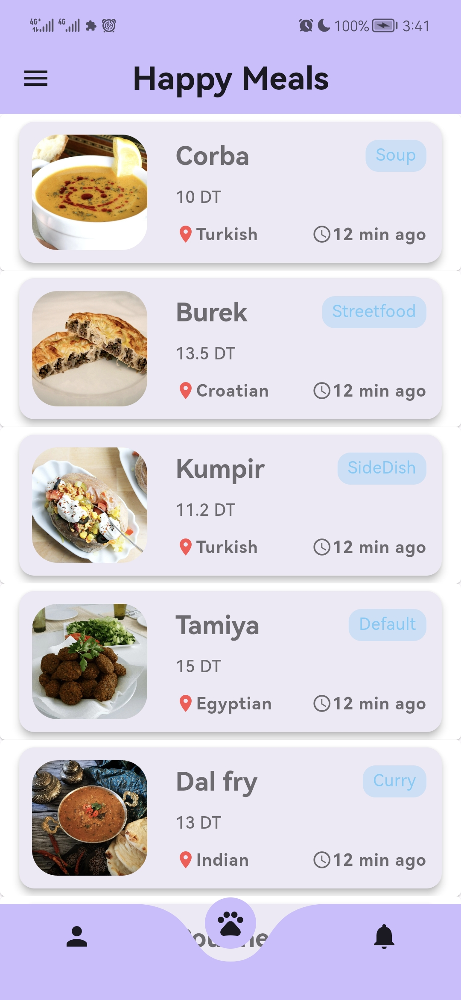
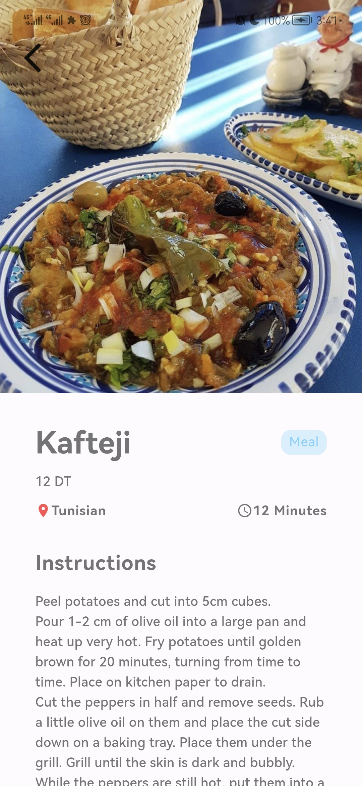
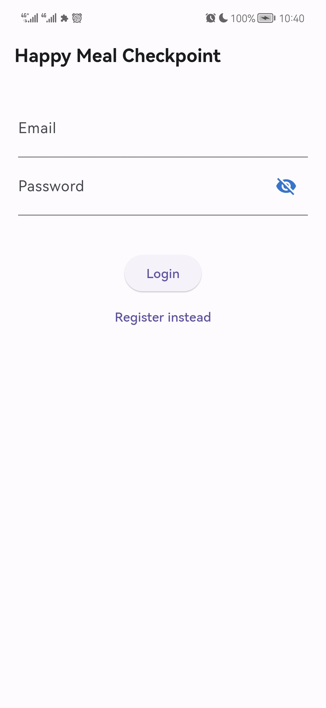
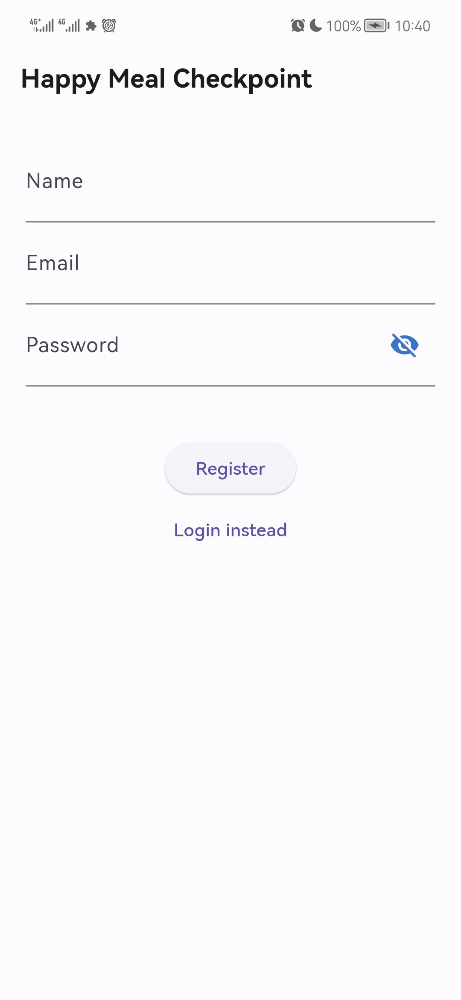
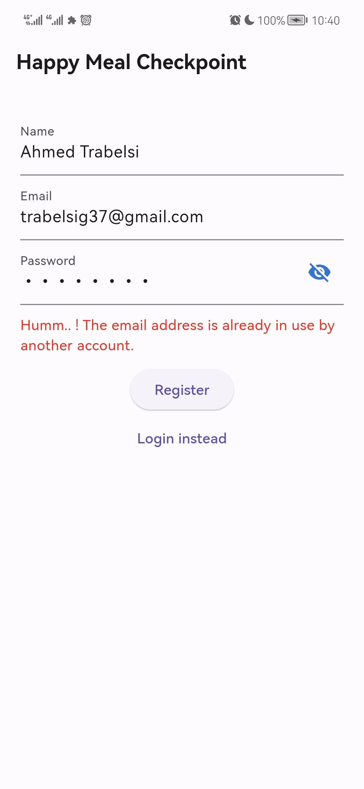
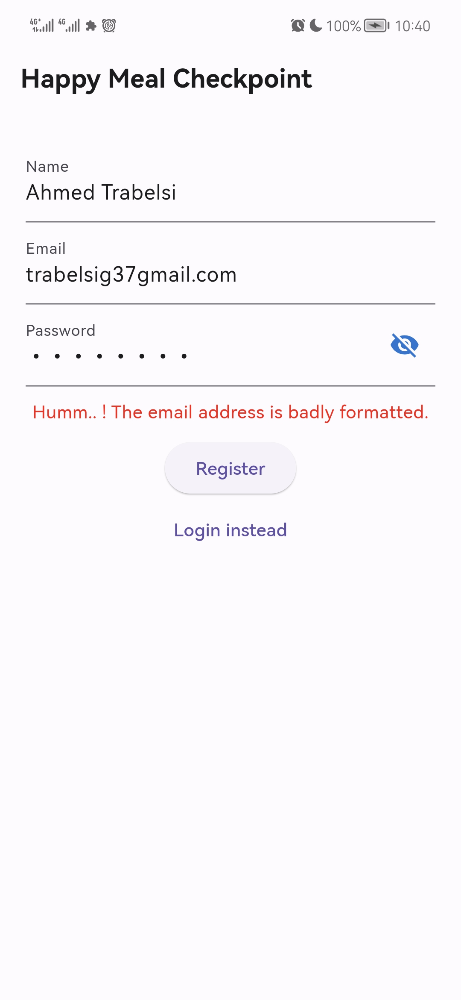
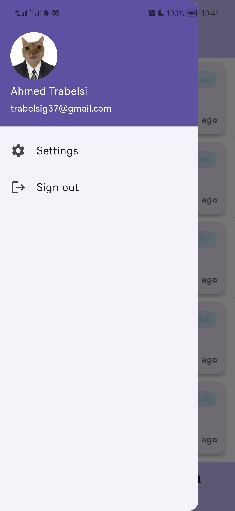

# Restaurant App

Welcome to the Restaurant App, a delicious Flutter project that brings the joy of exploring meals and their details right to your fingertips.

## Getting Started

This project is a fantastic starting point for your Flutter journey. If you're new to Flutter development, here are a few resources to get you started:

- [Lab: Write your first Flutter app](https://docs.flutter.dev/get-started/codelab)
- [Cookbook: Useful Flutter samples](https://docs.flutter.dev/cookbook)

For detailed guidance on Flutter development, check out the [online documentation](https://docs.flutter.dev/). It's filled with tutorials, samples, and a complete API reference.

## Screenshots

### Main Page

Explore a visually appealing main page with a delightful collection of meals. Scroll through and discover your next culinary adventure.

### Meal Details

Dive into the details of each meal, from mouth-watering images to intricate descriptions. This app provides an immersive experience for food enthusiasts.

### LoginPage

Experience a seamless login process with an intuitive and user-friendly login page.

### RegisterPage

Create a new account easily with the RegisterPage, where you can provide your information and get ready to explore the app.

### VerificationPage

Verify your account through a secure and straightforward verification process.

### VerificationPageEmail

Confirm your email address with the VerificationPageEmail, ensuring the security of your account.

### SignOutDrawer

Access the convenient SignOutDrawer to manage your account and sign out securely.

## How to Run

To experience the deliciousness firsthand, follow these steps:

1. Clone the repository.
2. Navigate to the project directory.
3. Run `flutter pub get` to get the necessary dependencies.
4. Launch the app using `flutter run`.

Enjoy exploring the world of flavors with the Restaurant App!

Happy coding and bon appétit!
